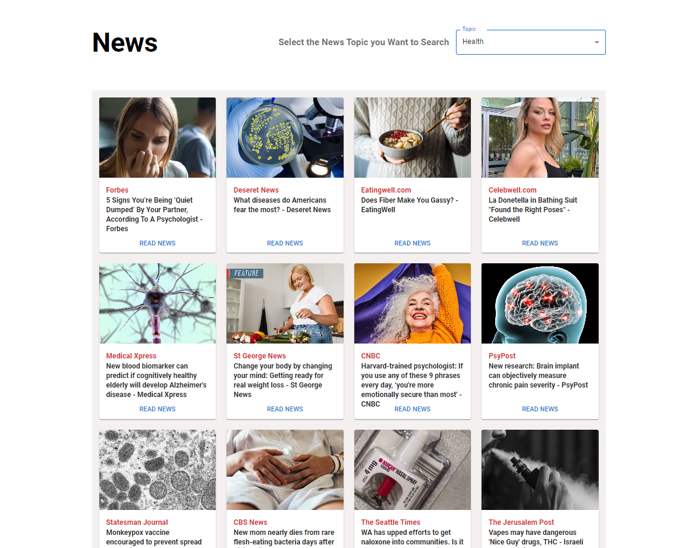

# News App!

<table>
    <tr>
        <td colspan="2" align="center">
            
             
            <h3>Home Page</h3>
             
        </td>
    </tr>
    <tr>
        <td width="50%" align="center">
            
             
            
Pagination

        </td>
    </tr>
</table>

> Website to search for the news trending topics

## Built with:

  

- **Frontend**: ReactJS, MaterialUI, axios
- **API**: newsapi.org

## Features

- Explore trending news topics
- Utilize pagination for more news
- Switch between different categories
- Directly access news sources by clicking on articles

### 📑 End note 

This application is currently not deployed in production due to the requirements of the NewsAPI.org API. During development, we utilized the API in its free mode to fetch news data. However, a paid plan with NewsAPI.org is required to deploy the application in a production environment.

We highly recommend obtaining a paid plan if you intend to use this application in a production setting. You can find more information about the plans and pricing on the NewsAPI.org website.

